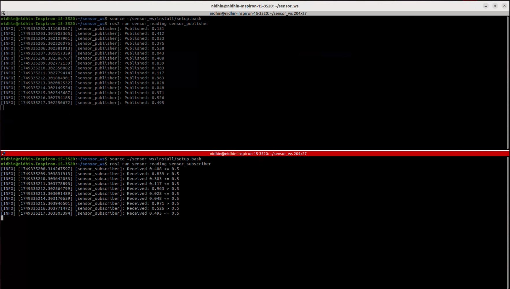
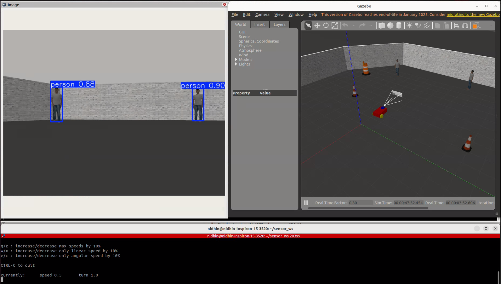

# 🤖 UGV Robotics Project using ROS 2 Humble and Gazebo

This project simulates an Unmanned Ground Vehicle (UGV) in a 3D environment using ROS 2 (Humble) and Gazebo. It includes multiple ROS packages that handle sensor simulation, UGV modeling, object detection, and navigation.

---

## 📦 Packages Included

- `sensor_reading`: Publishes and subscribes to simulated sensor data
- `gazebo_test`: Launches basic simulation world and robot
- `yolobot_gazebo`: Integrates the robot model and sensors into Gazebo
- `yolobot_recognition`: Implements person/object detection using YOLO
- `yolov8_msgs`: Custom message definitions for YOLOv8 inference

---

## 🛠️ Setup Instructions

### 🐧 ROS 2 Humble & Workspace Setup

```bash
# Create the workspace
mkdir -p ~/robot_ws/src
cd ~/robot_ws/src

# Clone repository 
git clone https://github.com/Nidhin-jyothi/Witsense-AI.git

# Move into the workspace root
cd ~/robot_ws

# Build the workspace
colcon build

# Source the setup script before using ROS 2 commands
source install/setup.bash

```

## 📡 Running Sensor Simulation

We begin by testing the sensor_reading package. This package contains:

A publisher node: sends random float values between 0 and 1 on the topic /sensor_x_readings

A subscriber node: listens to /sensor_x_readings and prints a message when values are greater than 0.5

## ✅ Commands to Run
Open a new terminal (and remember to source the workspace in each one):

```bash
source ~/robot_ws/install/setup.bash
```

Then run:

Publisher Node

```bash
ros2 run sensor_reading sensor_publisher
```

Subscriber Node

```bash
ros2 run sensor_reading sensor_subscriber
```

## 🖼️ Screenshot

📸 Below is a screenshot of the terminal showing both `sensor_publisher` and `sensor_subscriber` nodes running successfully:




## 🧍‍♂️ Person Detection using YOLOv8

This section demonstrates a live person detection system using YOLOv8 on a simulated UGV in Gazebo. The robot publishes camera images, performs inference using YOLO, and shows detection results in `RViz2`.

---

## 📦 Related Packages

- `yolobot_gazebo`: Launches the robot model with camera in a Gazebo world.
- `yolobot_recognition`: Runs YOLOv8 publisher and subscriber nodes for detection.
- `yolov8_msgs`: Custom message types used for YOLO detection results.

---

## 🧪 Running Person Detection

### 🧰 Step-by-Step Commands

## 📦 Required Dependencies
Install the following before running YOLO or Gazebo-based packages:

🔧 System & Python Dependencies
```bash
sudo apt update
sudo apt install ros-humble-teleop-twist-keyboard \
                 ros-humble-image-transport \
                 ros-humble-cv-bridge \
                 ros-humble-rviz2 \
                 ros-humble-gazebo-ros \
                 python3-colcon-common-extensions

pip install ultralytics opencv-python numpy
```

In each terminal, make sure to source your workspace first:
```bash
source ~/robot_ws/install/setup.bash
```

Also, source Gazebo:

```bash
source /usr/share/gazebo/setup.sh
```

## 🚀 Launch the UGV in Gazebo
```bash
ros2 launch yolobot_gazebo robot_model.launch.py
```

## 🧠 Start the YOLOv8 Detection Pipeline
In a new terminal:

1. Publisher Node – captures camera images and performs YOLO inference

```bash
ros2 run yolobot_recognition yolov8_publisher
```

2. Subscriber Node – listens to detection results and logs them

```bash
ros2 run yolobot_recognition yolov8_subscriber
```

### 🎮 Move the Robot
```bash
ros2 run teleop_twist_keyboard teleop_twist_keyboard
```

### 🧿 View Results in RViz2
```bash
rviz2
```
Add a new Image display

Set topic to: /inference_result

You should now see bounding boxes and detections in real time

## 🖼️ Screenshot – YOLO Detection in RViz

📸 Below is a screenshot showing person detection using YOLOv8 in RViz2 with live bounding boxes overlaid:




## 🗺️ SLAM and Navigation (Using Nav2)

This section covers how the UGV performs SLAM (Simultaneous Localization and Mapping) to create a 2D map of the simulated environment, and then reuses that map for autonomous navigation using the Nav2 stack.

---

## 📍 Steps to Run SLAM

### 🧰 Terminal Setup

In **each terminal**, source your workspace and Gazebo:

```bash
source ~/robot_ws/install/setup.bash
source /usr/share/gazebo/setup.sh
```

## 🚀 Launch the Gazebo World and SLAM
1. Launch the robot in the environment

```bash
ros2 launch gazebo_test gazebo_model.launch.py
```
2. Launch the SLAM node

```bash
ros2 launch gazebo_test online_async.launch.py
```
## 🧿 Open RViz and Visualize the Map

```bash
rviz2
```
Add Map display.

Set topic to: /map

## 🎮 Move the Robot Around to Build the Map
Use keyboard control:

```bash
ros2 run teleop_twist_keyboard teleop_twist_keyboard
```
Drive the robot around to build a full map of the environment in RViz.

## 💾 Save the Generated Map
Once the environment is explored:

```bash
ros2 run nav2_map_server map_saver_cli -f ~/robot_ws/src/gazebo_test/map/my_map
```
This saves two files: my_map.yaml and my_map.pgm.

## 🤖 Launch Navigation with Saved Map
Use the saved map to enable 2D Nav2-based path planning and navigation:

```bash
ros2 launch nav2_bringup bringup_launch.py use_sim_time:=True map:=~/robot_ws/src/gazebo_test/map/my_map
```
📌 In RViz:
Add Map and Costmap display types.

Use 2D Pose Estimate to set the initial robot pose.

Use 2D Nav Goal to set a destination.

UGV should now autonomously navigate using the previously created map!


